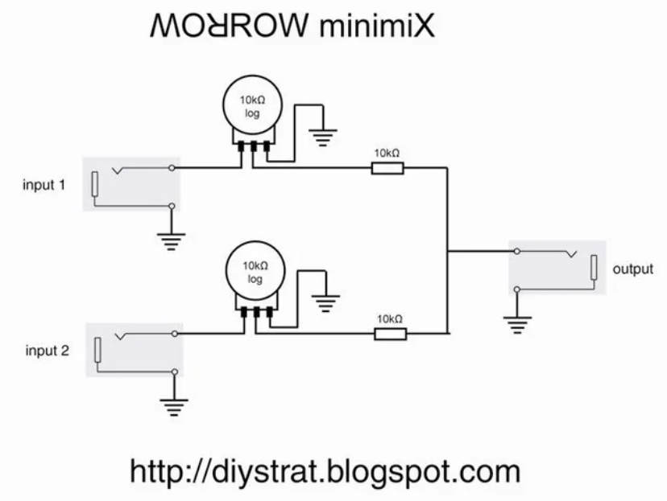

# Proyecto 03

Integrantes:

- Catalina Catalán / [06-terroiblea](https://github.com/terroiblea/dis8644-2026-1-procesos-2/tree/main/06-terroiblea)
- Martina Echavarría / [10-martinaechavarria-stack](https://github.com/terroiblea/dis8644-2026-1-procesos-2/tree/main/10-martinaechavarria-stack)
- Nicolás Miranda / [18-Nicolas-Miranda1312](https://github.com/terroiblea/dis8644-2026-1-procesos-2/tree/main/18-Nicolas-Miranda1312)
- Vania paredes / [24-paredesvania](https://github.com/terroiblea/dis8644-2026-1-procesos-2/tree/main/24-paredesvania)
- Carla Pino / [25-coff4](https://github.com/terroiblea/dis8644-2026-1-procesos-2/tree/main/25-Coff4)

## Sintetizador 

### Placas utilizadas

- Lub-dub (percutor)
- Barry Benson.  (percutor)
- Chirihue Mecanizado. (oscilador)

### BOM

| Componente                      | Cantidad  | Valor unitario  | Link compra                                                                                           |
|---------------------------------|-----------|-----------------|-------------------------------------------------------------------------------------------------------|
| Placa Barry Benson              | 1         | -               | -                                                                                                     |
| Placa Lub-dub                   | 1         | -               | -                                                                                                     |
| Placa Chirihue Mecanizado       | 1         | -               | -                                                                                                     |
| Chip 4069UBE                    | 1         | $1.100          | <https://www.cabezacuadrada.cl/product/cd4069/>                                                       |
| Chip CD40106BE                  | 3         | $750            | <https://www.cabezacuadrada.cl/product/cd40106be/>                                                    |
| Chip CD4070BE                   | 1         | $2.080          | <https://www.maspotencia.cl/circuito-integrado-cd4070be-14-pines>                                     |
| Chip LM324                      | 1         | $590            | <https://www.mechatronicstore.cl/amplificador-operacional-lm324/>                                     |
| Potenciometro 100K              | 8         | $490            | <https://www.mechatronicstore.cl/potenciometro-rotacional-10k/>                                       |
| Potenciometro 250K              | 4         | $495            | <https://altronics.cl/potenciometro-lineal-250k-b250k\>                                               |
| Capacitor no polarizado 10nf    | 1         | $100            | <https://www.mechatronicstore.cl/condensadores-ceramicos-distintos-valores/>                          |
| Capacitor no polarizado 100nF   | 7         | $100            | <https://www.mechatronicstore.cl/condensadores-ceramicos-distintos-valores/>                          |
| Capacitor polarizado 0.22uF 50V | 1         | $100            | <https://www.mechatronicstore.cl/condensador-capacitorio-de-electrolitico-por-unidad-varios-valores/> |
| Capacitor polarizado 1uF 50V    | 1         | $100            | <https://www.mechatronicstore.cl/condensador-capacitorio-de-electrolitico-por-unidad-varios-valores/> |
| Capacitor polarizado 10uF 50V   | 8         | $100            | <https://www.mechatronicstore.cl/condensador-capacitorio-de-electrolitico-por-unidad-varios-valores/> |
| Capacitor polarizado 100uF 50V  | 4         | $100            | <https://www.mechatronicstore.cl/condensador-capacitorio-de-electrolitico-por-unidad-varios-valores/> |
| Resistencia 1K                  | 9         | $100            | <https://www.mechatronicstore.cl/resistencias-electricas-3w-por-unidad/>                              |
| Resistencia 100K                | 2         | $100            | <https://www.mechatronicstore.cl/resistencias-electricas-1-2-w-1-unidad/>                             |
| Led 3mm/5mm                     | 5         | $100            | <https://www.mechatronicstore.cl/led-3mm-5mm/>                                                        |
| Diodo 1N4007                    | 3         | $200            | <https://www.mechatronicstore.cl/diodo-rectificador-in4007-1n4007-4007/>                              |
| Diodo 1N4148                    | 4         | $120            | <https://www.cabezacuadrada.cl/product/diodo-1n4148/>                                                 |
| Regulador de Voltaje L7805      | 3         | $490            | <https://www.mechatronicstore.cl/regulador-limitador-de-voltaje-5v-dc/>                               |
| Barrel Jack Switch              | 6         | -               | -                                                                                                     |
| Audio Jack                      | 5         | -               | -                                                                                                     |
| Conector Pinsocket  (placa)     | 6         | $400            | <https://www.ebay.com/itm/125539599767>                                                               |
| Pernos 3mm (para mountinghole)  | 13        | $39,9           | <https://www.mercadolibre.cl/pack-x100u-perno-allen-m3-negro-cabeza-boton-8mm/>                       |
| Switch encendido/apagado        | 3         | -               | -                                                                                                     |

### Placas Soldadas 

| Lado A                     | Lado B  |
|---------------------------------|---------------------------------|
|  |  | 
|  |  | 
|  |  | 

### Proceso 

| Registro                 | Registro  |
|---------------------------------|---------------------------------|
|  |  | 
|  |  | 
|  |  | 

 
 

### Mixer

Pensamos en que los sintetizadores funcionen a partir de sonidos superpuestos, por lo que las placas no se tocan entre si hasta la salida, que sera controlada por un mixer, es decir los sonidos de cada placa saldran por separado pero al mismo output.

Para el Output está pensado ocupar la placa de parla, un amplificador, pero aún está en conversación.

 

<https://diystrat.blogspot.com/2008/08/two-channel-mini-mixer.html> 

## Partituras 

Performance de 5 minutos con el sintetizador diseñado. 

### Partitura 1

Esta no tiene pentagramas, no tiene corcheas, no tiene nada que te haga sentir mal por no saber solfeo. Es una partitura para tres criaturas electrónicas que nunca han tomado clases de música y están muy bien así.

El sintetizador se toca en tiempo real, ajustando las perillas de cada módulo según las instrucciones de cada acto. La obra dura 24 horas y está pensada para ser tocada una vez al día, todos los días.

- Todas las perillas parten en 0°, es decir, giradas completamente hacia la izquierda. Los grados indicados en la tabla se cuentan desde ese punto girando en sentido horario. Por ejemplo, 180° es exactamente la mitad del recorrido de la perilla.

#### 08:00 – 12:00

El Chirihue Mecanizado está despertando pero no quiere molestar a nadie. Berry Benson apenas se escucha, como una abeja muy educada que recién llega al trabajo. Lupdup está ansioso. Son las 8am.

| Módulo | Perilla 1 | Perilla 2 | Perilla 3 |
|--------|-----------|-----------|-----------|
| Chirihue Mecanizado | 240° | 220° | 60° |
| Berry Benson | 220° | 240° | 60° |
| Lupdup | 240° | 220° | 200° |

#### 12:01 – 16:00

El Chirihue canta con energía. Es mediodía y tiene cosas que decir. Berry se está acomodando: más lenta, pero más fuerte. Lupdup ya almorzó.

| Módulo | Perilla 1 | Perilla 2 | Perilla 3 |
|--------|-----------|-----------|-----------|
| Chirihue Mecanizado | 280° | 260° | 200° |
| Berry Benson | 140° | 160° | 180° |
| Lupdup | 160° | 140° | 160° |

#### 16:01 – 20:00

El Chirihue canta lento y bajito, se está yendo. Berry es muy lenta pero reina con volumen, es la hora de la abeja. Lupdup está cansado pero presente.

| Módulo | Perilla 1 | Perilla 2 | Perilla 3 |
|--------|-----------|-----------|-----------|
| Chirihue Mecanizado | 80° | 60° | 40° |
| Berry Benson | 60° | 80° | 260° |
| Lupdup | 80° | 100° | 240° |

#### 20:01 – 07:59

El Chirihue se fue a su nido de cables a descansar. Berry también se fue. Lupdup sigue. Los corazones no saben lo que es el descanso.

| Módulo | Perilla 1 | Perilla 2 | Perilla 3 |
|--------|-----------|-----------|-----------|
| Chirihue Mecanizado | 0° | 0° | 0° |
| Berry Benson | 0° | 0° | 0° |
| Lupdup | 40° | 40° | 180° |

#### Notas de interpretación

- Las perillas no mencionadas en la tabla se dejan fijas en la posición que suene mejor al momento de armar el instrumento. No se tocan durante la interpretación.
- Las transiciones entre actos no son abruptas. Las perillas se giran despacio, como quien no quiere que nadie se dé cuenta de que algo cambió.
- Los grados son un punto de partida, no una ley. Si al girar una perilla suena horrible, gírala hasta que suene bien y anótalo. La partitura es un ser vivo.
- Si en algún momento los tres módulos suenan al mismo tiempo en su punto más alto, eso no es un error. Eso es el clímax. Felicitaciones.
- El silencio de 20:01 a 07:59 no es silencio total: Lupdup sigue latiendo. Siempre sigue latiendo.

### Partitura 2

Cada una de las líneas en la partitura representan ciertas cosas:

- Para las abejas, representadas de color amarillo (🟡), se hicieron las líneas que se usan para ilustrarlas de manera caricaturesca.
- El corazón, representado en color rojo (🔴) es utiliza las lineas de signos vitales que se pueden ver en una máquina de signos vitales.
- Para el pájaro, representado en color naranjo (🟠), se hizo una variación de un espectrograma que captaba el sonido de las aves. (*Los espectrogramas son un gráfico visual que muestran los sonidos o señales acústicas registradas.*). 

#### Notas de interpretación

- Por el lado izquierdo de la partitura, se dividió en 5 partes iguales para medir el volumen, siendo la línea del centro el valor medio del volumen en general, considerando el valor mínimo (0) y el máximo (100).
- En medio de la partitura, está igualmente se parte en 5, pero en este caso, cada separación representa un minuto de la partitura.

