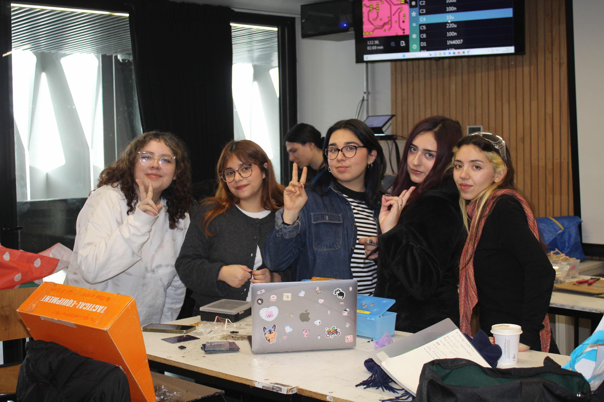
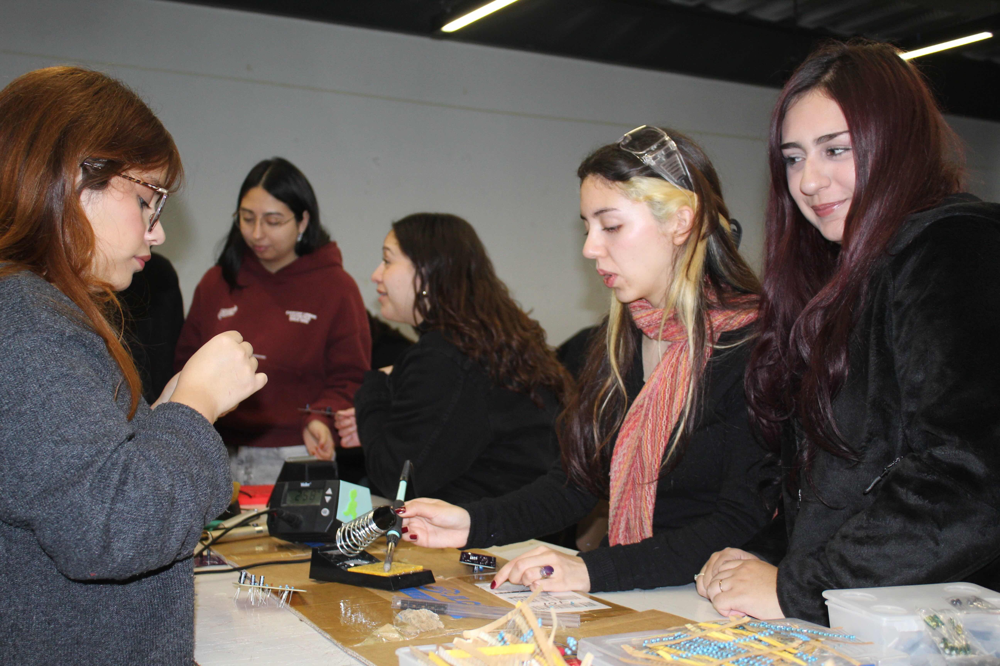
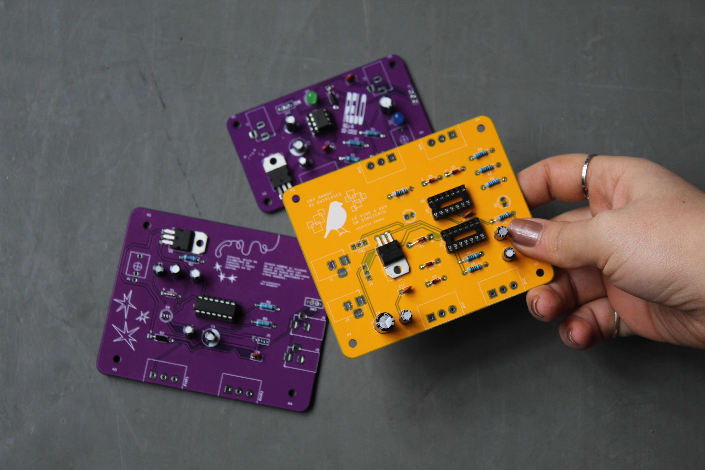

# sesion-14a

martes 16 de junio

## clase

llegaron las pcb y fue día de soldar
yo iba acomodando los componentes de a uno y verificando que sean los correctos, y también que estuviesen del lado correcto en el caso de los zapatitos de chips, condensadores y diodos

soldamos 4 placas en total:

- 1 chirihue
- 1 comunicaciones espaciales
- 1 clock
- 1 placa de otro grupo

se soldaron todo lo que era nuestros componentes y algunos de los que eran parte de los estándares, quedó pendiente soldar algunos LEDs porque queríamos usar unos que tengo yo que son rosados y morados!! los soldaremos el jueves para tenerlo listo para la entrega del viernes 

### fotitos proceso en clase

