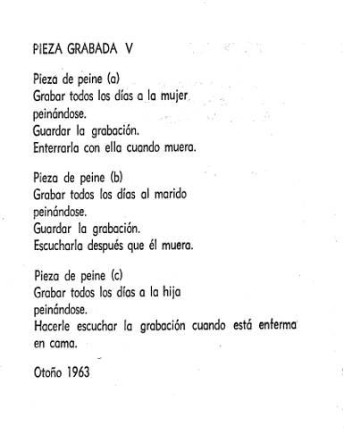
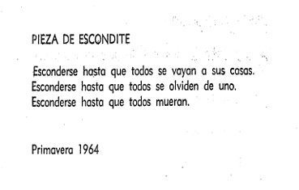
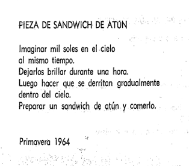
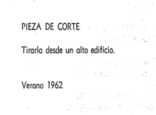

# sesion-13a  
Martes 9 de Junio

No pude estar muy presente en esta sesión, tuve que atender mis compromisos y me llenaron el pelo de laca. Volví con un fuckass bob

# Guía de exportación desde KiCad

Antes de exportar la PCB, es importante revisar que las zonas de cobre estén correctamente rellenadas y ejecutar **DRC (Design Rules Checker)** para detectar posibles errores antes de enviar los archivos finales.

---

## 1. Selección de capas para exportación

Para que el fabricante acepte el diseño, hay que incluir las capas necesarias dentro de la sección **Trazar (Plot)**.

Las capas obligatorias son (7):

- **Edge.Cuts:** define el contorno y forma final de la placa.
- **F.Cu:** capa de cobre frontal (superior).
- **B.Cu:** capa de cobre trasera (inferior).
- **F.Mask:** máscara de soldadura frontal.
- **B.Mask:** máscara de soldadura trasera.
- **F.Silkscreen:** serigrafía frontal, textos y elementos visuales.
- **B.Silkscreen:** serigrafía trasera.

---

## 2. Generación de archivos

### Archivos Gerber

Desde la ventana de **Trazar (Plot)** se selecciona la carpeta de destino y se ejecuta la opción **Trazar**.

Esto genera los archivos **.gbr**, que contienen la información necesaria de cada capa de la PCB para su fabricación.

### Archivos de taladrado

Luego se debe seleccionar **Generar archivos de taladrado**.

Estos archivos son importantes porque indican dónde deben realizarse los agujeros de la placa. Se generan archivos con extensión **.drl**.

---

## 3. Revisión y entrega final

### Revisión con Visor Gerber

Antes de enviar los archivos, se recomienda abrirlos en el visor Gerber de KiCad para comprobar:

- Que el contorno de la placa esté correctamente definido.
- Que los agujeros coincidan con los pads.
- Que las capas estén alineadas correctamente.

### Compresión de archivos

Para entregar los archivos al fabricante, se deben seleccionar todos los archivos generados:

- Archivos **.gbr**
- Archivos **.drl**
- Archivo **.gbrjob**

Luego comprimirlos en un archivo **.zip**.

---

# Proyecto 03  
Última entrega y 50% de la nota final.

## Evaluación Individual

1. **Presentación oral:** Exposición individual del proyecto.
2. **Revisión de bitácora:** Evaluación del proceso documentado durante el semestre.
3. **Lectura:** Leer y compartir lo leído en la bitácora.

## Evaluación Grupal

1. **Lista de materiales (BOM):** Entrega de la *Bill of Materials* completa del proyecto.
2. **Ensamblaje de PCBs:** Fabricación y ensamblaje de **3 PCB** funcionales.
3. **Propuesta de partitura experimental:** Desarrollo de una partitura experimental con una duración aproximada de **5 minutos**.

# Lectura  
Pomelo (*Grapefruit*) de Yoko Ono

  
Primera edición, 1964

Libro de artista desarrollado por Yoko Ono, destaca como una de sus obras más reconocidas y a diferencia de una presentación física como suele ser habitualmente en el oficio, contiene una serie de *partituras de eventos* que el intérprete puede o no llevar a cabo.

"Las partituras de eventos implican acciones, ideas y objetos sencillos de la vida cotidiana recontextualizados como performance. Son textos que pueden considerarse propuestas o instrucciones para acciones. La idea de la partitura sugiere musicalidad. Al igual que una partitura musical, las partituras de eventos pueden ser realizadas por artistas distintos del creador original y están abiertas a la variación e interpretación"
fuente: [alisonknowles.com](https://www.aknowles.com/eventscore.html)

## Encargo 13-a  
Leer el capítulo 1 (Música) y 2 (Pintura).

Al principio me estaba costando un poco entender el libro porque al ser un libro de poesía [a.k.a instrucciones poéticas (...confusión] iba a tratar metáfora que tuviera que interpretar para entenderlo, lo que usualmente me cuesta. Pero mientras fui avanzando, me di cuenta de que el texto no buscaba esconder un significado detrás de las palabras, sino transmitir una experiencia, una forma particular de observar el mundo y permitirme interpretar las intrucciones a través de mi propia imaginación. Eso hizo que la lectura se volviera mucho más accesible e interesante para mí. Empecé a prestar más atención a las imágenes, sensaciones y reflexiones que proponía Yoko, en lugar de intentar descifrar constantemente un mensaje oculto. A medida que avanzaba, pude conectar mejor con el contenido y disfrutar la lectura desde una perspectiva más abierta y menos analítica.

### 1. Música
El libro tiene instrucciones para hacer obras de arte imaginarias, este capítulo se centra en la composición de sonidos (conceptual, poco convencional) invitando a hacer cosas con nuestros propios cuerpos o lo que tengamos a la mano. Todas las instrucciones te permiten hacer algo.

Estas fueron las piezas que más capturaron mi atención: 

<table>
<tr>
<td width="40%">

</td>
<td width="60%">

Esta pieza parece una observación de algo muy cotidiano y repetitivo, algo tan habitual que termina pareciendo natural e incluso invisible. La acción de peinarse es algo que se hace todos los días y no parece tener nada extraordinario. Pero al llegar al final de la instrucción, la obra cambia de sentido. Ya no se trata solo de registrar una rutina diaria, sino de acumular una memoria de esa persona a lo largo del tiempo (hasta la muerte... X o X).

Estas instrucciones llevan la atención desde la acción cotidiana hacia el paso del tiempo, la memoria y la muerte. Me llamó la atención cómo una acción tan simple puede adquirir un peso tan grande a través de una instrucción. Me hace pensar que lo que hacemos todos los días podría contener un valor que normalmente no percibimos, y que solo se vuelve evidente cuando aparece la posibilidad de la enfermedad, la ausencia o la muerte.

</td>
</tr>
</table>

<table>
<tr>
<td width="40%">

</td>
<td width="60%">

No sé como explicar esta con palabras, solo me imagino lo que pueda pasar mientras me esconda hasta morir. ¿Qué tiene que ver con el sonido, qué voy a hacer mientras me esconda? Nadie además de mi va a ser testigo de lo que pase cuando esté escondida ¿puedo estar en silencio? Instrucciones muy amplias... pero muy determinantes, porque son hasta las muerte...

</td>
</tr>
</table>

<table>
<tr>
<td width="40%">

</td>
<td width="60%">

: 3  yo quiero estar ahí, aunque no como atún. Esta no me hizo pensar directamente, solo me transporté a esa sensación (ohmmm).

</td>
</tr>
</table>

## 2. Pintura

Aquí se proponen obras que existen a través de la imaginación. Aunque se presentan como pinturas, no son objetos terminados. Su realización depende completamente de quien las lee y de la forma en que decide imaginarlas o llevarlas a cabo.

Veo estas piezas como imágenes que se forman en la mente. Más que describir una pintura específica, las instrucciones funcionan para construir una imagen mental propia. Todos podemos imaginar algo distinto a partir de la misma propuesta, por lo que la obra nunca queda completamente definida y permanece abierta a múltiples interpretaciones.

Mi favorita:  

Creo que de todas las piezas que he leido hasta ahora, lo que más rescato es como lo imaginativas que llegan a ser las piezas me permiten interpretarlas con un rango muy amplio de sensaciones y pensamientos, me permiten conectar en el presente. https://www.youtube.com/watch?v=m6F65e3ZXG4 

