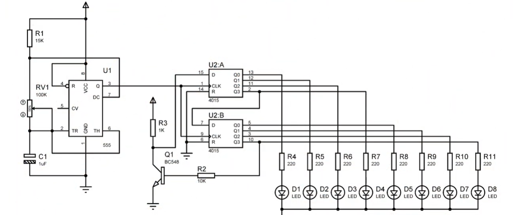

# sesion-11a

 26 de mayo

## Proceso 

* En esta clase llevamos los chips que más nos parecieron interesantes para abordar este proyecto.
* Entre las dos propuestas, las que preferimos fueron las del CD4015 y el CD4040.
* Por lo que entiendo, el CD4040 cuenta en binario; por lo tanto, el resultado de los LEDs es una numeración binaria.
* El CD4015 es más simple, solo lo realiza en cascada, se van prendiendo de a poco los LEDs (los que muestran cómo funciona) hasta que se llenan todos y se apaga lentamente siguiendo una línea.
* CD4015: 2 registros de desplazamiento independientes de 4 bits. Permite controlar hasta 8 LEDs o componentes.
* Ejemplo en video:
https://www.youtube.com/watch?v=UFtW6kHt54g

* Decidimos que usaremos de principal el CD4015 y el CD4040 lo tendremos de secundario.
* Usaremos este esquemático como referencia para la realización del PCB y el protoboard:

## Misa estándar

Usaremos algunos componentes estándar que serán para todos los grupos, dejaron un repositorio con los archivos, una lista y una captura.
* Cada uno de los grupos usará dos jacks, los cuales servirán de entrada y salida.

---

## Encargo

* Nos dividimos la tarea y a mí me tocó simular el CD4015 en Falstad, ya que en TinkerCAD no aparece este componente.
* Mi sorpresa fue cuando ni Falstad tenía el CD4015. Decidí investigar a ver si alguien había realizado algo parecido o replicado este chip y mi sorpresa fue encontrar a una persona que había hecho un sintetizador con 3 4015 y un 4093. Dejaré su página: https://lorre-mill.com/2024/04/29/Cycling24.html
* Por lo que copié y pegué el CD4015, pero me encontré con un problema: esa versión solo contenía las compuertas de Q1 a Q8, Data y Voltaje.
* Por lo que, para mínimamente poder replicar esto, necesité de una compuerta NAND gate, la cual es una puerta lógica digital que produce una salida falsa (0) solo si todas sus entradas son verdaderas (1). En cualquier otro caso, la salida es verdadera (1):
Dejaré acá mi proyecto realizado de [Falstad](https://falstad.com/circuit/circuitjs.html?ctz=DwYwlgTgBAZgvAIgIwKgFwM6IAwDpsEECsqYIiAnLgOwAcAzBRbQCxH0BstATEvaiABGidqgAOwhEWyoAbhETVUAW0wiApgFokKAHwAoKFGAB3KAA9EO7lCQUb1qN24tU8BDID0Bo6YtWkG2cWW2oOJxc3HARvQ2MQf2RAiJDHblpaKI8BRHotJSgwWRx8bBQoDAVsqFkAE0RuXG4ubF5qbiZWFloiV1jfAHNEtIzbZPpsV1ho-uNoSySHezGbDin3GSgqpEJCGJ9jMwXHNacWbCg1rK8D4AAlYeTT2gur6eqTDZUAQ3NiqX2cWAABUwMp1PMrGEoBRwnYbLCshw5EQSoRqNIMXZqBQWNQkD1aMjZn4Fi5XiEJiE3l8SUdcpNLpTGYFMu8bkD6Qh6EQHBwLlTbPzroDfFyeXyBbyoPRuCK6cN+TLJbZ7PLblzHPChRd4erOYrdcskNC9ezRcYhmT2k4iOFuDaHXLzSTIQhaLCoC8vZ6kMLzVsGtwOb43UTUkrw17Nl9AwhnCG5okGCqU9GRXGExbgGGCDroxcXhmqlnXYkwrR8xX0wGS8Hs27qJwq82i7Wg4mc+WWUrqIy27G6523Rwbd7R5Lix3swBlMBiAD2M4AFmAYGhEvzK9r2kbne5aGbBGBEGzl-8KKhamgg30NYkJfnH9w7fqxQ-pS-wlvbciXfeFjtC5gkubBK2CN9jAAOW+AA7WpElhXUWBCJDQj-WkANPT1vVxEIBxmLCEDw6MYRQ2wUMg0lKHI3DoQI7IFQWCh6IuFi4Uo-8DWYpV6GbICZU4Ki3TQkC0KpKd43rJjKF4xlxKErj3x44CXBhJUTQwwjuJEXj+KVCClMtTcx1eG0aW0wZu3wi4+2pdZLOMhZq29asLMY24rUUVtbObdzOy891ZVItN-OzQKo29KMwpJCK8yivMYtuMQNzJNTgvSStZSycplG+KxdnEBcSgmYNdnKwgSAqAAbRA7nUDAwAwNA4JAdRsy5L8hRlaU-So8VevCR9sqM6ipMpFURswoEFygdRYIaVAMDEXJ90Qcx+CgFbsgOXwxBqaIKnIeNEz2g7uSW468AIDgX2zTwF1ub5agAKzmhopnUE9kFQebEAAYigBcYCgAAhMBMBUBafqgZRjiWm8EEB4GwYhjBAWATxwAgAwgA)

## Me equivoqué.

* Había entendido que tenía que hacer yo el esquemático del CD4015, lo había hecho alguien del grupo. No me acordé y terminé haciéndolo igual.
* Lo bueno es que ahorré un poquito de trabajo, ya que puse las huellas y los estándares.
