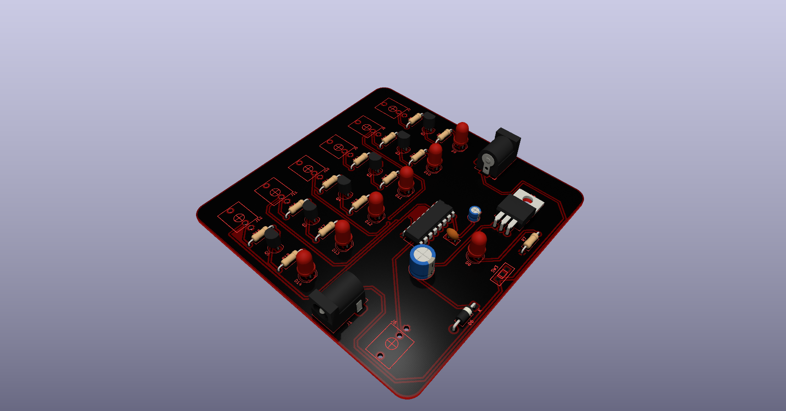
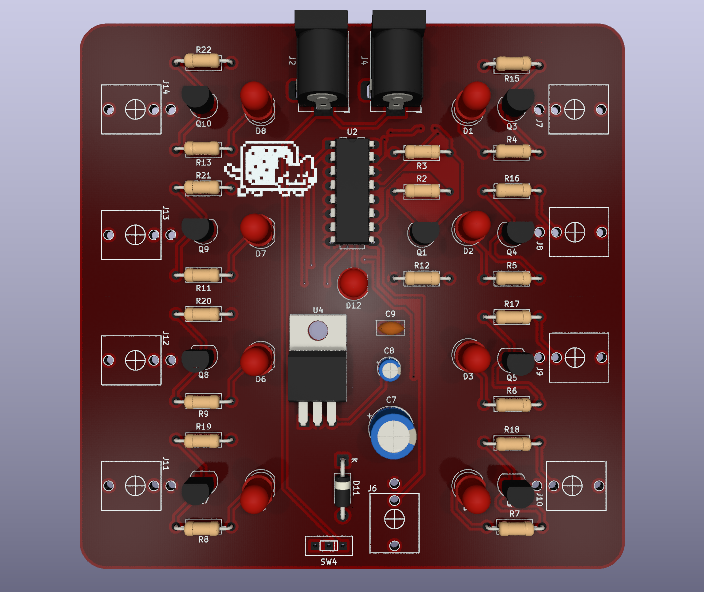

# sesion-11b

Viernes 29 de mayo

---

## Proceso

Usaremos este esquema para guiarnos en el armado del CD4015 en el protoboard: 

* Ya testeado e investigado de manera virtual el CD4015, ahora toca comprobar si nos funciona replicándola en una protoboard.
* En el primer intento no nos resultó debido a que no conectamos los cables de voltaje y tierra al otro protoboard.
* Se prendía solo hasta el cuarto LED, y tampoco oscilaba ni se reiniciaba automáticamente.
* Sospechamos del mal montaje de las resistencias y LEDs, por lo que, resuelto eso, ya funcionaba, pero como que se tildaba en algunas partes.
* Para solucionar esto, cambiamos la resistencia que tenía el 555, ya que esto provocó que oscilara de manera extraña.
* Al cambiar las resistencias, dio más tiempo al chip, más margen temporal, un clock más lento hace el circuito más estable.

## Encargo

* Por mi parte, me tocará hacer la parte de la placa de las propuestas del CD4015 y CD4040.
* No tengo mucho que contar, ya que fue hasta terapéutico, solo tuve unos problemas con unas islas de cobre, pero nada grave.

**PCB del secuenciador CD4040:**

**PCB del secuenciador CD4015**

