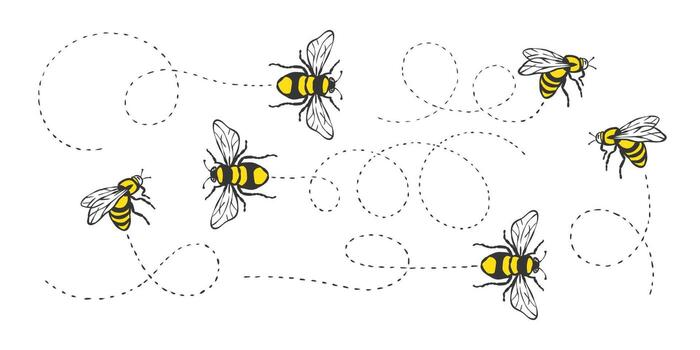

# sesion-13b
### Viernes 12 de junio

#### Clase

Estuvimos analizando los entregables para el proyecto 03 los cuales consistían en:
+ 2 Partituras
+ BOM (bill of materials)
+ 3 placas soldadas

**Partituras**

Estuvimos pensando la manera en la que nos queríamos expresar con la partitura. Se nos ocurrió usar un tipo de camino de línea punteada, algo así como un sendero, combinándolo con los latidos del corazón.

**BOM**

Estuvimos haciendo cambios en el BOM, ya que lo incluimos en la entrega anterior de manera opcional, lo que nos facilitó este proceso. Conversamos e intercambiamos información con el grupo 4 sobre los materiales que usaron para incluirlos en la lista.

**Placas**

Como grupo elegimos la placa del grupo 4, el chirigüe, ya que nos vimos fascinados por el tipo de sonido y alcance que se logró en ese proyecto. Igualmente, según nosotros, armoniza con nuestras placas porque replica un sonido natural.
Entonces nuestras placas serían: Barry Benson, Lup Dup

**Extra**

También estuvimos platicando y haciendo una lluvia der ideas para la carcasa que usaremos en el proyecto final. Nos imaginamos una especie de jardín incluyendo potenciómetros disfrazandose de flores.

## Encargo cap 3 y 4

**Destacadas**

#### Cap 3
1.- Pieza de confusión: Usar las cosas hasta que se derritan.
Enjuagarse los dedos pegajosos después de usarlas.

Usar las cosas hasta que se evaporen.
Tomar agua después de usarlas.

Usar las cosas hasta que se apaguen secas y duras.
Hacer con ellas una flauta.

Con esta parte siento que entiendo y me identifico con ello. Las cosas están para usarse aunque a veces no quiero desperdiciarlo y me digo a mi misma que las cosas tienen su propósito y se tiene que acabar en algún momento. Si es posible aprovacharlo al máximo, exprimir cada gota de lo que quede hasta que su existencia se apague.

2.- Pieza solar: Ver el sol hasta que se ponga cuadrado.

#### Cap 4

1.- Pieza de dolar: Elegir una suma de dólares.
Imaginar todas las cosas quepueden comprarse con esa suma. (a)
Imaginar todas las cosas queno pueden compararse con esa suma. (b)
Anotarlas en un trozo de papel.

Imaginar las posibilidades y los límites.

2.-Poema tátcil: Dar a luz un niño.
Ver el mundo a través de su ojo.
Dejar que toque todo lo posible y que deje la huella de sus dedos en lugar de firma.

No gracias.

3.- Pieza sílbica: Decidirse a no usar una sílaba en particular el resto de la vida.
Registrar las cosas que ocurren como resultado de esto.

Decisiones aleatorias que por alguna razón te decides a hacerlas.

En lo personal no me gusta mucho Yoko Ono pero como dice el dicho quizá: "A broken clock is right twice a day"
