# sesion-09a

- ## KiCad pt2
  - aprendimos más sobre el proceso de las PCB y cableado
    - como pasar del esquematico al editor de placas
      - asig***nand***o huellas a los simbolos
    - traspasar los componentes en una placa (perimetro que dibujamos)
    - ordenar los componentes y cablearlos con F.Cu y B.Cu
      - F.Cu y B.Cu siendo ambas capas de cobre
      - como pasar de la capa F.Cu a la B.Cu con vías
      - los diametros y dimensiones de vias y cables
    - crear el GND común
    - ver errores
    - ver en 3d
   
- ## tarea!!!!11!
  - practicar lo visto en clases en el synth que hicimos para la entrega pasada
  - tenía que arreglar el esquema que entregamos ya que faltaban los terminales de conexión (GND y VCC)
    - 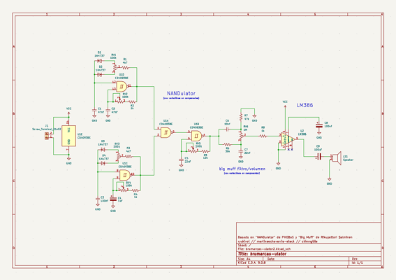
    - 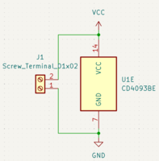
    - también me faltaba asignar todas las huellas correspondientes a los componentes
      - unas huellas ya nos las habían dado la clase pasada
        - Capacitor_THT:C_Disc_D3.8mm_W2.6mm_P2.50mm 
        - Resistor_THT:R_Axial_DIN0207_L6.3mm_D2.5mm_P10.16mm_Horizontal 
        - Capacitor_THT:CP_Radial_D5.0mm_P2.50mm 
        - Potentiometer_THT:Potentiometer_Alps_RK163_Single_Horizontal
      - 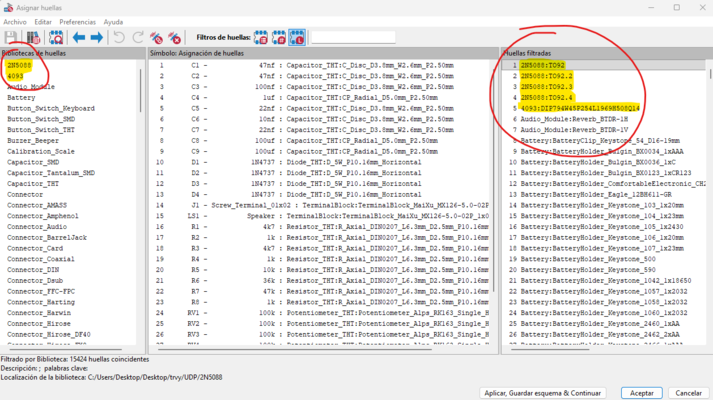
      - (destaco todas las añadidas personalmente, no las que están en el circuito trabajado)
        - algo importante que me faltaba eran las huellas del CD4093BE y LM386
          - para esto me metí a SnapMagic (www.snapeda.com)
            - ahí uno puede buscar el componente y descargar las huellas y simbolos correspondientes
              - la gracia es que varios están verificados para asegurarse que están bien hechas
        - 
        - 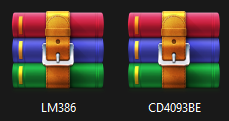
          - se descarga un zip y se extrae en una carpeta
            - dentro de KiCad uno se mete a "Administrar biblioteca de huellas" y selecciona la carpeta donde extraiste el zip
              - se apreta "aceptar" y debería estar añadido para asignar
            - 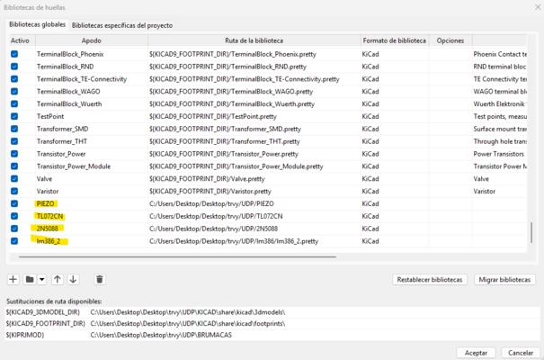
           
  - al tener todo asignado uno puede pasar a la vista de editor de placa
    - primero uno debe pasar todo del esquemático
      - 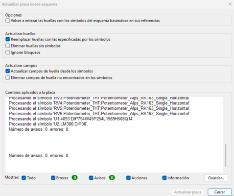
        - te indíca si hay algun problema de conexión o de un componente no asignado etc...
    - para ubicar todo uno primero crea la placa en la capa "Edge.Cuts" utilizando las herramientas de linea y arcos
      - y para afinar la placa se curvan las esquinas
        - 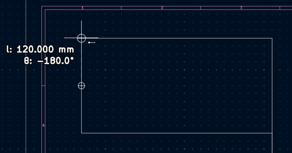
        - 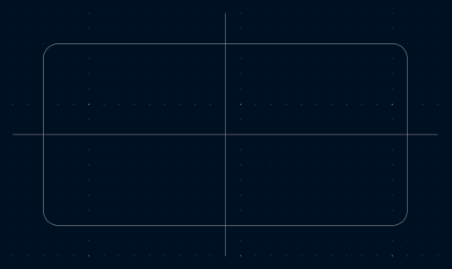
          - lineas de guía para ubicar a los componentes en capa "User.1"
    - puse los componentes en ese orden por que quería que la PCB se viera como el esquematico
      - 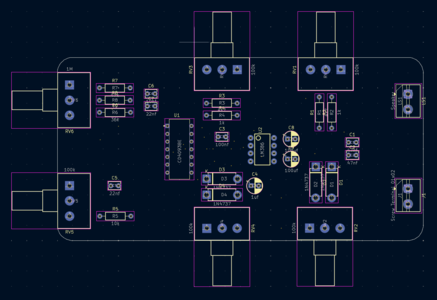
      - después se conectan los componentes entre sí
        - KiCad muestra con lineas los componentes que se conectan además de aclarar las entradas al selecciónar con la herramienta de "Enrutar Pista"
      - 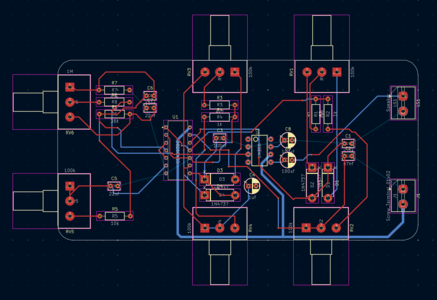
        - apretando "V" al enrutar te permite poner vías que me permitan usar ambas capas de cobre, haciendo más facil conexiónes entre puntos
        - uno tiene que crear las vías y pistas que va a usar
          - nosotros usamos pistas de 0.4mm y 0.8mm
            - y vías de 0.3mm y 0.2mm
        - todo esto en las capas "F.Cu" y "B.Cu"
      - 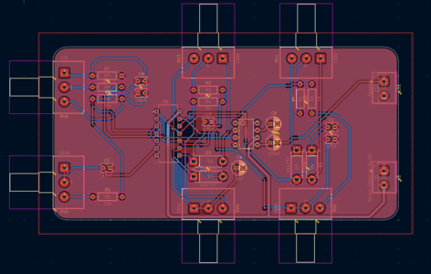
        - aquí se crea el GND común con "Dibujar zonas rellenas" que hace que la placa entera sea GND excluyendo las vías y pistas que sean VCC
      - al hacer todo uno puede verificar lo que hizo con "Comprobar reglas del diseño"
        - 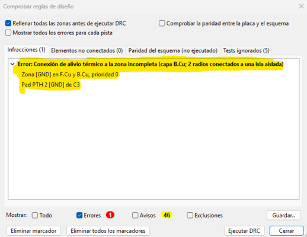
          - no entiendo que significa pero por lo menos es uno
            - ojalá arreglar ese error no cree otros
      - ahora se puede ver el producto final en 3D
        - 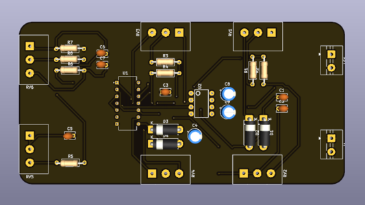
        - 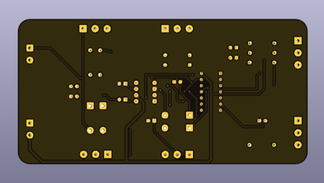
          - se puede ver como las pistas cruzan capas por las vías
         
    - ### mini extra musica importante
      - 
        - "What It’s Like to Be a Bat" de Finn Streuper
          - album de electronica jazz ambiental
            - muy lindo, me calma mucho y tiene una producción experimental que me fascina
              - cambios de fuerza en sonidos y utiliza instrumentos que asumo que son acusticos como de cuerda y los mezcla con synths
              - https://www.youtube.com/watch?v=BuqKwlKF2y8
                - Album Visualizer que usa un osciloscopio!!!!
      - 
      - https://janeremover.bandcamp.com/album/status-update-music
        - "status update music" de leroy (Jane Remover)
          - musica alternativa electronica basada en samples y sonidos dupstep y hardstyle
            - uno también encuentra estructuras o sonidos tipo reggaeton, cyber-punk'ish, jumpstyle, complextro y más que probablemente no reconozco
            - recomiendo "#BOYLETMEKNOW" y "Summer Fling", ambas muy distintas pero fantasticas
            - realmente no entiendo como alguien puede hacer esto
      - 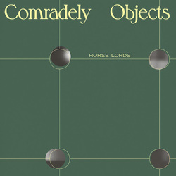
      - https://horselords.bandcamp.com/album/comradely-objects-2
        - "Comradely Objects" de Horse Lords
          - art-rock experimental con cosas polirritmicas
            - siento que todo está pasando en una fase distinta pero de alguna manera todo suena acorde (???)
            - tiene unos saxofónes medios locos que suenan desafinados pero van 100% con la instrumentación
            - recomiendo "Zero Degree Machine"
