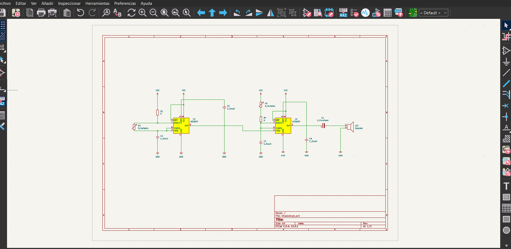
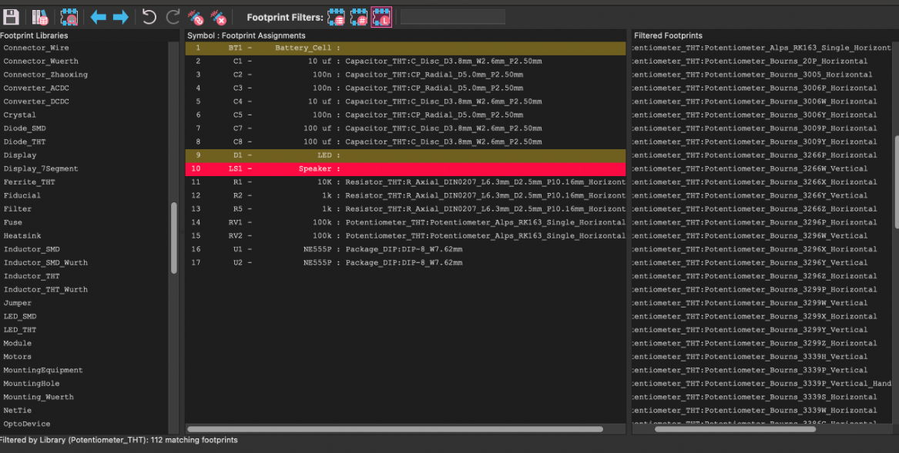
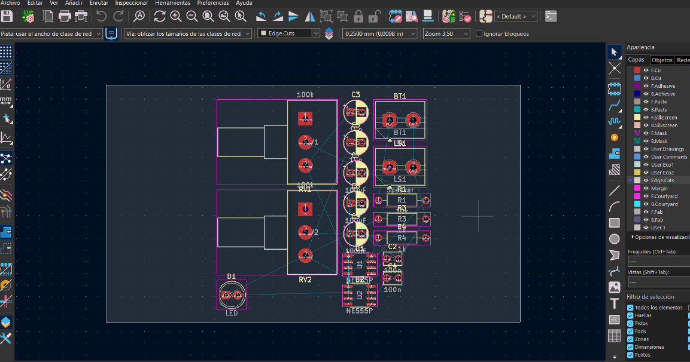
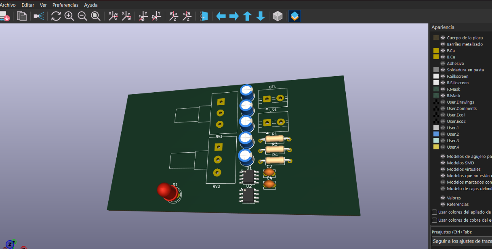

# sesion-08a

27-04-2026

## Apuntes de clase – KiCad

## ¿Qué es KiCad?

KiCad es un paquete de software libre y de código abierto para la automatización del diseño electrónico (EDA). Permite a ingenieros, estudiantes y aficionados crear diagramas esquemáticos y diseñar placas de circuito impreso (PCB) listas para fabricación.

## Introducción al flujo de trabajo

En esta clase comenzamos a familiarizarnos con KiCad y su forma de trabajo general. El primer paso fue crear un nuevo proyecto, donde el software genera distintos archivos asociados a cada etapa del diseño.

- El archivo `_sch` corresponde al esquemático, donde se diseña el circuito de forma abstracta.
- El archivo `_pcb` permite visualizar cómo ese esquemático se materializa en una placa física (PCB).

## Ejercicio inicial

Como ejercicio introductorio realizamos el esquemático del **Atari Punk**, un circuito que ya conocíamos previamente, ya que lo habíamos armado en protoboard a comienzos del semestre. Esto permitió entender la traducción entre un circuito físico y su representación digital.

## Símbolos y huellas

Dentro de KiCad es fundamental distinguir entre:

- **Símbolos**: representan el circuito de manera abstracta y esquemática.
- **Huellas (footprints)**: corresponden al mundo físico y definen cómo el componente se monta en la PCB.

Esta relación puede entenderse usando la lógica de Aristóteles (**Género – Especie – Individuo**), que en KiCad se traduce como:

- **THT – Resistor – R2**

## Estructura de archivos del proyecto

KiCad organiza toda la información del proyecto a partir de un archivo central y otros archivos asociados:

- `.kicad_pro` → archivo de proyecto (conecta todos los demás)
- `.kicad_sch` → esquemático
- `.kicad_pcb` → PCB

Estos tres archivos son la base para poder diseñar y fabricar nuestras placas.

## Pasos para crear una PCB

### 1. Crear el esquemático

Se construye el circuito utilizando símbolos electrónicos y conexiones lógicas.

### 2. Asignar huellas

Se reemplazan los símbolos por sus equivalentes físicos.  
Para esto se abre el diálogo **Assign Footprints**, donde se asocia cada símbolo con su huella correspondiente según:

- Tipo (THT o SMD)
- Tamaño físico real

### 3. Visualizar y editar la PCB

Desde el editor de esquemático se abre el **PCB Editor**, donde aparecen todos los componentes listos para ser distribuidos.

En esta etapa es importante:

- Ordenar los componentes
- Dibujar el contorno de la placa, ya que el software arroja errores si no existe
- Asegurarse de hacerlo en la capa correcta

