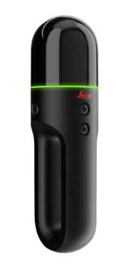
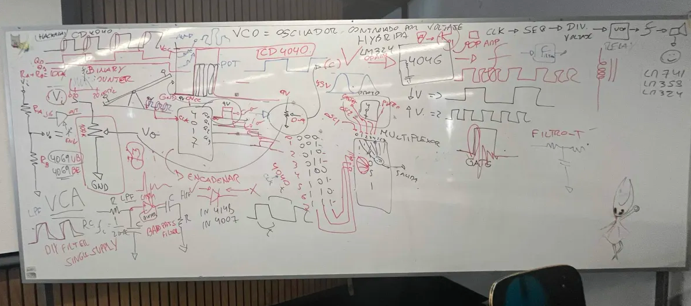

# sesion-10a

19-05-2026

## Apuntes de la clase

## Charla: *For Want or (Not) Measuring*  
*(Para querer o no medir)*

La primera parte de la clase consistió en asistir a una charla realizada en **Repu**, titulada *For Want or (Not) Measuring*.  
Este proyecto fue desarrollado en 2022 por **Jim Hobbs ** y **Patrick Adam Jones **, y se centra en explorar la relación entre arte y medición.

El eje principal del proyecto es reflexionar sobre cómo los artistas miden sus obras, entendiendo que cada uno utiliza sistemas y criterios propios. A partir de esto, los autores buscan generar una conversación entre distintas prácticas artísticas, relacionando la medición con la forma de producir y pensar la obra.

En cada exposición del proyecto se integran artistas locales. En esta ocasión, la muestra se presentará en el **CEINA** este sábado, y me interesa mucho asistir a verla.

---

## Proyecto que me gusto

Uno de los trabajos que más me llamó la atención fue el de ** Simon Withers ** y **Philip Hudson **.  
Ellos utilizaron un escáner láser, una herramienta que normalmente se emplea en proyectos de arquitectura o infraestructura de ingeniería.

Este dispositivo funciona mediante espejos giratorios: uno en el eje **X** y otro en el eje **Y**, lo que permite capturar vértices del entorno. Gracias a este sistema, lograron registrar más de **8 millones de puntos**, con los cuales escanearon árboles de más de **365 años** de antigüedad.

Durante la presentación, Simon mencionó una frase que me pareció especialmente potente:

> *“Para el árbol, nosotros somos muy rápidos; pero para las montañas, el árbol es muy rápido.”*

Esta idea refuerza la idea de escala temporal y cómo la medición cambia dependiendo del punto de vista desde el cual se observa el mundo.

---

### Clase express de chips  

4046
Es un PLL (Phase Locked Loop). Se usa para sincronizar una señal con otra en frecuencia o fase. Incluye un oscilador controlado por voltaje (VCO) y comparadores de fase, muy común en síntesis de frecuencia y control de señales.

4093
 Contiene 4 compuertas NAND con disparador Schmitt. Sirve para crear osciladores, filtros antirruido y circuitos lógicos más estables frente a señales ruidosas o lentas.

---

Secuenciador
No es un chip único, sino un circuito que activa salidas en un orden determinado. Se usa para generar pasos, ritmos o patrones, por ejemplo en luces, motores o música electrónica.

4040
 Es un contador binario de 12 etapas. Divide la frecuencia de una señal de entrada y genera salidas binarias, muy usado en relojes, divisores de frecuencia y secuenciadores.
