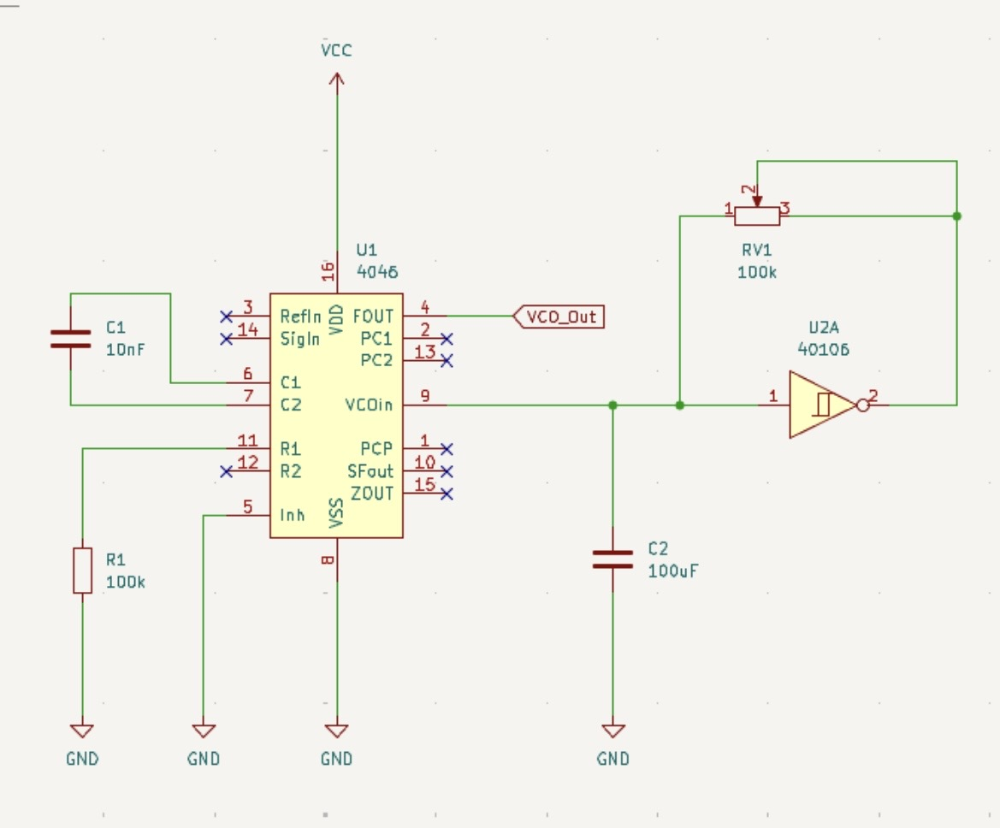

## Trabajo en clase proyecto 02

seguimos trabajando en los circuitos 

## Opción 1

**CD4046**

El CD4046 es un circuito integrado de tecnología CMOS que incorpora un oscilador controlado por voltaje (VCO) y un lazo de enganche de fase (PLL). Gracias a estas características, puede emplearse en aplicaciones como multiplicación de frecuencia, demodulación de señales FM y conversión entre tensión y frecuencia. Su rango de alimentación se encuentra entre 3 V y 18 V.

**NE555P**

El NE555P corresponde a un temporizador integrado de alta precisión y gran versatilidad, desarrollado por Texas Instruments. Se utiliza ampliamente para la generación de pulsos, señales oscilatorias y retardos temporales con buena exactitud. Su tensión de funcionamiento está comprendida entre 4,5 V y 16 V.

**CD4017**

El CD4017 es un contador decimal con diez salidas decodificadas. Cada pulso recibido en la entrada de reloj provoca la activación secuencial de una de sus salidas, avanzando de la salida 0 a la 9. Este dispositivo es comúnmente utilizado en sistemas de conteo, temporización y secuenciación de señales. Dependiendo del fabricante, puede operar con tensiones de alimentación entre 3 V y 15 V, llegando en algunos casos hasta 18 V.

## Opción 2

**CD4046**

Se emplea el circuito integrado CD4046, que integra un PLL y un VCO en tecnología CMOS, siendo adecuado para aplicaciones relacionadas con el procesamiento y sincronización de frecuencias.

**CD40106**

El CD40106 contiene seis compuertas inversoras con entradas de tipo Schmitt Trigger. La histéresis proporcionada por estas entradas permite mejorar la inmunidad al ruido y acondicionar señales con variaciones o fluctuaciones. Además, puede utilizarse para implementar osciladores y generadores de onda cuadrada mediante configuraciones sencillas con resistencias y condensadores. Su rango de alimentación se extiende desde 3 V hasta 18 V, siendo habituales los usos a 5 V o 9 V.

> A partir de estas dos alternativas, se elaboraron los correspondientes esquemáticos en KiCad con el fin de evaluar su viabilidad y determinar la solución más adecuada para el desarrollo del proyecto.
