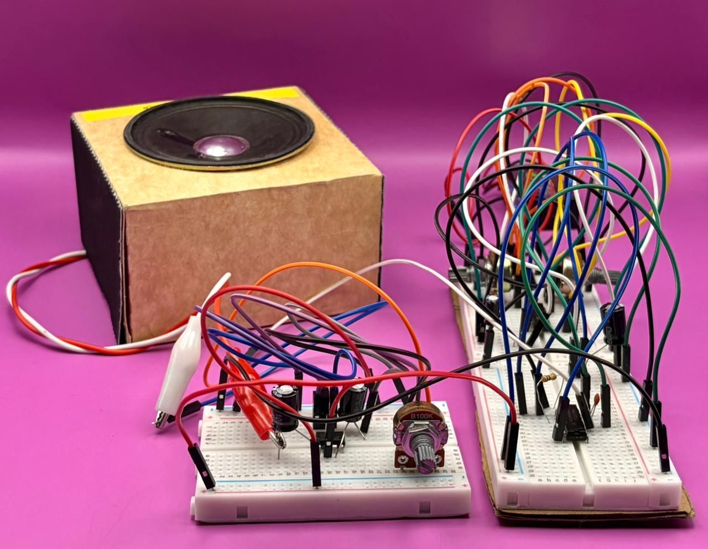

# sesion-11b
22 de mayo

## Trabajo en clases...

Durante esta sesión armamos el oscilador en la protoboard para comprobar si funcionaba correctamente. En el proceso aparecieron algunos problemas que ya habíamos visto antes. Primero nos dimos cuenta de que uno de los chips se había quemado debido a una conexión incorrecta, por lo que tuvimos que reemplazarlo. Luego notamos que la batería estaba descargada y, además, habíamos olvidado alimentar los chips, así que corregimos ambos errores y continuamos con las pruebas.

Una vez funcionando, sentimos que el sonido no era el esperado, por lo que le pedimos ayuda a nuestro compañero Nicolás Miranda. Él identificó un detalle que se nos había pasado: habíamos confundido algunos pines del chip 4046. Después de corregir esa conexión, el circuito comenzó a funcionar correctamente y el resultado fue mucho mejor de lo que esperábamos.

Sin embargo, la otra alternativa que estábamos evaluando no nos convenció del todo, ya que la variación del sonido era bastante reducida. Por esta razón seguimos investigando y encontramos una nueva opción que nos pareció interesante. No alcanzamos a probarla completamente porque no contábamos con más potenciómetros disponibles, pero esperamos poder revisarla y desarrollarla en la próxima sesión.

