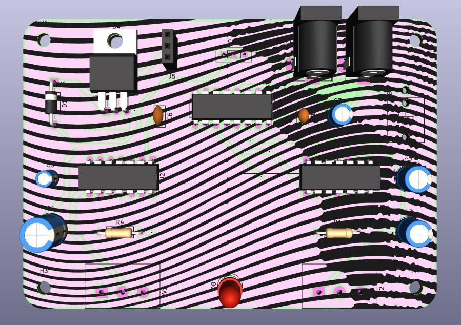
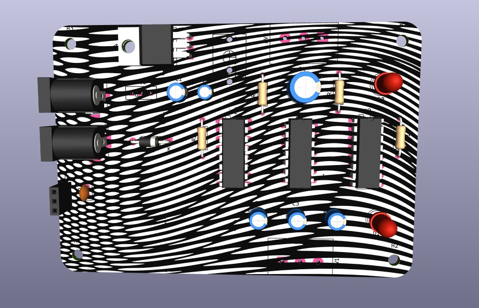

# sesion-12a

## Última clase antes de la entrega pipipipi

Esta fue la última clase antes de la entrega. Determinamos que otro día nos reuniríamos para trabajar en el proyecto. La verdad, fue un trabajo largo. Nos dividimos algunas tareas para poder lograrlo y quitarnos un poco de peso como grupo.

Trabajamos lo que restaba de la semana. El jueves 04 de junio nos quedamos hasta tarde en la U. La mitad del curso estaba en el LID y todos fueron de mucha ayuda. Este día nos dedicamos a determinar el diseño de PCB y a terminar las placas.

