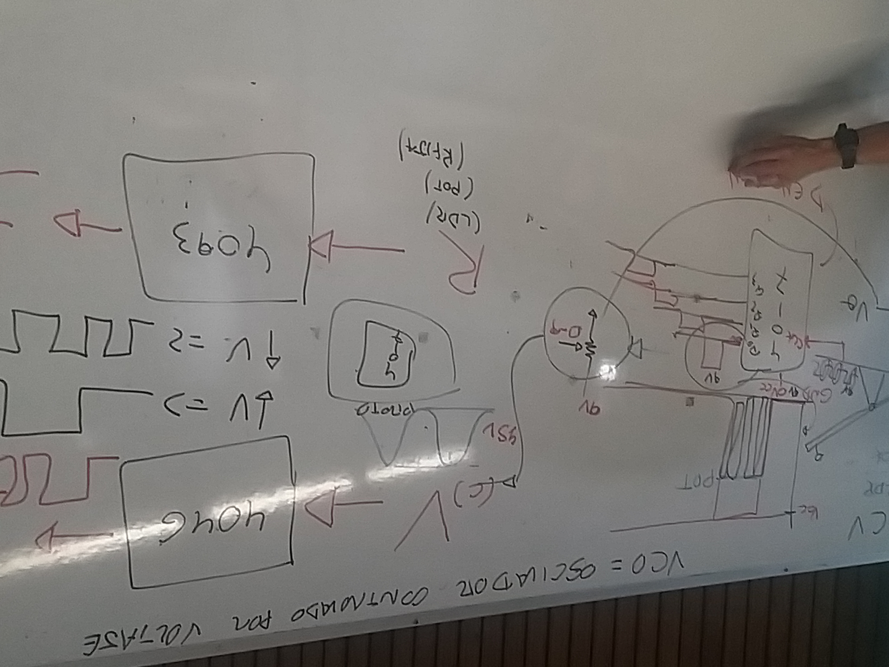
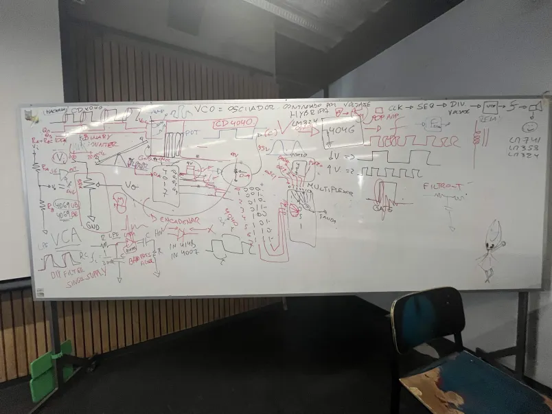

# sesion-10a

Tuvimos una charla para aliviar el ambiente de la semana de solemnes teoricas! por lo que transcribire todo lo que escribí 

El proyecto partió en 2022 -> la exhibición terminó expandiendose y siendo varias en otros lugares, para estar mano a mano con otros proyectos.

- Se supone que este proyecto se basa en el sistema de medición de la vida *Por ejemplo con el concepto del tiempo*

- Patric tiene un gran proyecto y una galeria (la 78) en Londres

Hace 300 años se quizo medir el peso del mundo, por lo tanto ellos se subieron a una montaña (una bastante grande) variadas veces a lo largo del tiempo para intentar medir este peso (pero solo eso equivalía un 20%)

## Unstable  Sistems

Transferencia simbolica -> Inestabilidad incluso en algo tan estructural como una grilla "perfecta"

- Este tipo de proyectos es importante de compartir con el mundo por lo que también es importante el dialogo con otros.

- Cada exposición es una nueva versión del proyecto ya que se ven los contextos especificos, por cara curador que habla representando el proyecto

---

Escaner que tiene un laser que choca con el mundo

El modelo tiene 8 millones de puntos que se van buscando pero, cada punto es un caso diferente en todo sentido...por lo tanto son 8 millones de casos diferentes escaneables!

*Es importante el tema del grupo y la unidad en vez de solo medir y ya*

(En esta parte nos mostraron una red parecida a la de un arbol al usar el escaner...en un propio arbol)

- Se debe pensar en el arbol, no como un "arbol" si no como una red de situaciones 

- El arbol crece lentamente al estar vivo, este se adapta a todo lo que pasa, junto a sus ramificaciones

*Tiene 365 años solo con sus frecuencias*

Para nosotros, el arbol es lento. Para el arbol, nosotros somos rapidos y para la montaña... 

AL FINAL TODO ES CUESTIÓN DE PERSPECTIVA CHAVALES!

---

## Fin de la charla y apuntes de la clase:

IC P11 4046 -> caja negra que convierte el voltaje en frecuencia

*se puede cambiar sin una resistencia y usar otro aparato* 

Si es un voltaje bajo es más lento y si es el voltaje más alto entonces es más rapido

4093 + 555 -> aparato que convierte resistencia a una frecuencia 

VCO: Oscilador controlado por voltaje

4017 + potenciometro : genera un voltaje ajustado, el cual pasa a un 4046 y al variar el voltaje, se harán variables los tonos del chip.

---

El profesor Missa nos dio ciertas palabras claves para buscar los mejores chips y la pagina Hackaday:

Y si, en mis notas escribí Coopel...y era COWBELL (como campana de vaca)

Esta es una pagina con un Cowbell pero, solo el video:

<https://hackaday.com/2022/05/12/how-the-roland-808-cowbell-worked/>

Al ir al video, este contendra un link...que está caido

Pero siempre se puede volver en el tiempo:

<https://web.archive.org/web/20220513113911/http://www.frisnit.com/roland-tr-808-cowbell-rebuild/>

---

## Cap 4 y 5 GO!

El capítulo 4 aborda el acto de tomar fotografías, y Flusser lo compara con una especie de cacería (bien salvaje). Sin embargo, no la sitúa en espacios abiertos, sino dentro de un bosque lleno de objetos. Según él, el fotógrafo no está persiguiendo algo en el mundo exterior, sino explorando las posibilidades que la misma camara permite (por el hecho de ser una caja negra con sus limitantes). La realidad termina siendo más un punto de partida, que el objetivo principal.

También menciona que la fotografía tiene un carácter antiideológico, ya que no existe un punto de vista absoluto capaz de imponerse sobre todos los demás. Siempre hay muchisimas  perspectivas posibles y el fotógrafo no escoge necesariamente la "mejor" sino la más acta para ser fotografiada.

"Por tanto, cualquier cosa que el fotógrafo capture debe traducirse en una situación"

Ya para el cap 5, el señor Flusser analiza la fotografía como *objeto*. remarca que las imágenes en blanco y negro no existen realmente en el mundo tal como lo percibimos nosotres, debido a que el blanco y el negro representan condiciones extremas: *la ausencia total o la presencia completa de luz*

Desde esa perspectiva, una fotografía en blanco y negro no reproduce la realidad así tal cual. En cuanto a las fotografías a color, aunque suelen parecer más cercanas a lo real, también son construcciones irreales, la diferencia es que disimulan mejor eso, aunque sigan siendo falsas

*Un ejemplo son como en las cámaras se pueden ver los ambientes más iluminados de lo que vemos realmente con nuestros ojos*

Al final nuetro autor sostiene que la fotografía no presenta el mundo en sí, sino ideas o conceptos sobre él (por ello las imagenes tecnicas). Para él, las fotografías más logradas son aquellas en las que el fotógrafo consigue la victoria sobre las limitaciones y posibilidades programadas de la cámara, logrando que sus propias intenciones prevalezcan, dando así una pequeñisima victoria del humano ante la maquina.

WOOOOOOOOOOOOPI 	¬( ` ω ´ )/
