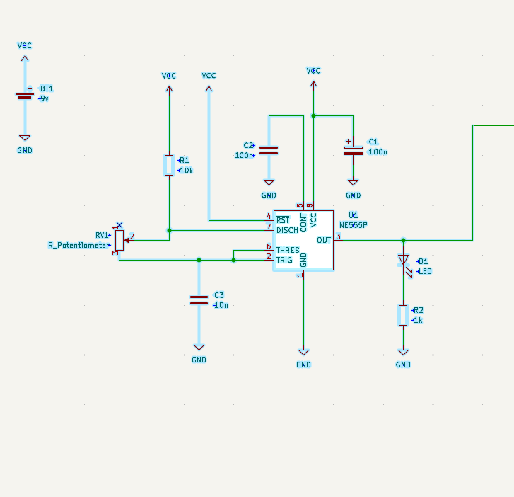
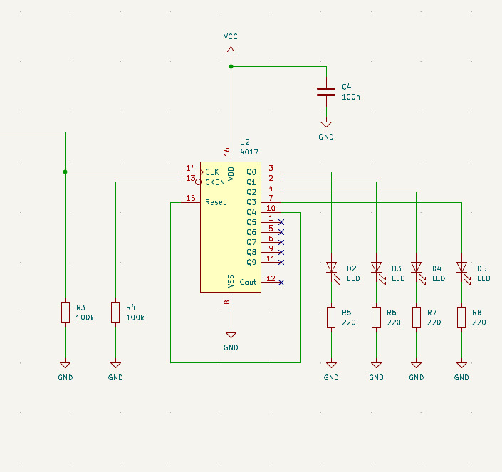
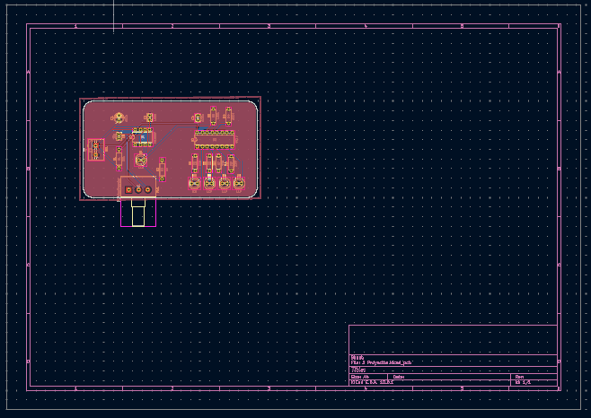
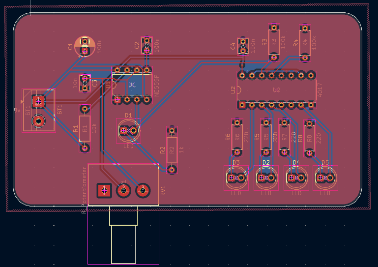
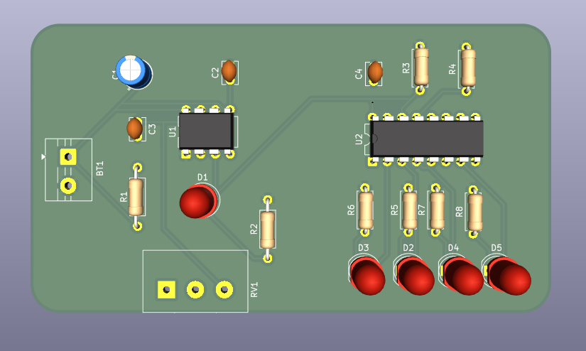
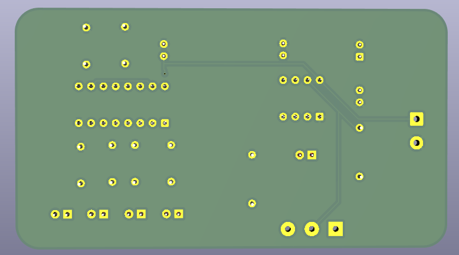

# sesion-09a

martes 12 de mayo de 2026

## encargo-09a

### esquemáticos y PCB en KiCad

cada estudiante debe tomar 2 de las 4 secciones distintas del sintetizador realizado en el proyecto 1, y crear un proyecto en KiCad por cada una, que contenga tanto el esquemático y la PCB de cada sección.

anotar cada paso en la bitácora, incluyendo mayores aprendizajes y dificultades encontradas, además de problemas y dudas que quieran que abordemos en la próxima clase.

### lectura de libro de Flusser, capítulo 1

leer introducción y capítulo 1 del libro Hacia una filosofía de la fotografía, de Vilém Flusser, disponible en <https://monoskop.org/images/8/8d/Flusser_Vilem_Hacia_una_filosofia_de_la_fotografia.pdf>

compartir apuntes y reflexiones críticas sobre el texto, prohibido usar inteligencia artificial, no sirve para este ejercicio.

---

### Solución encargo

Primero creé un nuevo proyecto desde cero con el prototipo del plano hecho anteriormente en clase para tener una referencia de cómo crear el plano de los circuitos que en este caso usaré los del CHIP 555 y el CHIP 4017

Comencé creando el esquemático del chip 555 copiando prácticamente lo que habíamos hecho en clase

Lo que me confundía al principio eran los comandos para buscar los objetos, pero al entender cómo usarlos ya se me hizo más rápido hacer el ejercicio de usar los comandos

Luego sentí sencillo el hecho de hacer las conexiones porque lo asimilé a las clases pasadas y fui creando en mi mente las conexiones como si lo estuviera haciendo en la protoboard, cosa que lo hizo más entendible para mí

### Clock generator

Y como no sabía si crear 2 proyectos, procedí a colocar el chip 4017 con sus respectivas conexiones para luego colocar todos los elementos en la PCB

### Secuenciador

Posteriormente pasé el esquemático a PCB para hacer la "tarjeta de presentación" con el cuadrado y en la capa edge.cuts

Luego los elementos los distribuí en el lado izquierdo "555" y lado derecho "4017", donde no tuve ningún inconveniente porque mientras iba distribuyendo por la placa iba corroborando en el plano dónde debería estar más cerca cada elemento del chip y su respectiva pata, ejemplo: las resistencias, capacitores, potenciómetros, etc...

Al hacer las conexiones utilicé un ancho de 0,400 mm en las capas (F.CU y B.CU, dependiendo de cada lado) para las pistas y en algunos casos tuve que utilizar vías, así pudiendo alcanzar la conexión sin extender tanto la pista de conexión

Por último sé que en F.Silkscreen y B.Silkscreen puedo agregar un dibujo o texto, pero en este caso no coloqué ninguno para observar mejor cómo tengo las conexiones para este primer ejercicio

### Resultado de PCB:

Lo que más aprendí fue interiorizar de una mejor manera cómo hacer las pistas, que no es tan confuso en verdad. Lo que sí puede complicarme un poco son los detalles en todas las herramientas porque hay muchas y hay varias que no usamos que a lo mejor puedan funcionarnos mejor o sería mejor no tocar para no dañar el archivo por equivocación.
